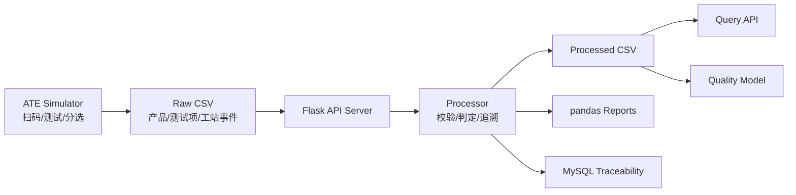

# 电源适配器 ATE 测试追溯与质量分析平台

面向电源适配器自动化测试场景的数据处理与追溯平台。项目覆盖从 ATE 测试线数据生成、规则判定、结果追溯、良率报表、接口查询到质量预测的完整链路。

```text
C++ ATE Simulator -> Raw CSV -> Flask API -> Processor -> Reports / MySQL / Query API / Quality Model
```

## 核心能力

- 支持模拟扫码、耐压测试、性能测试和自动分选流程，生成 ATE 原始测试数据。
- 支持通过 Flask API 触发测试数据处理、报表生成和 MySQL 入库。
- 支持按配置文件完成测试项 PASS/FAIL 判定，并记录结构化不良原因。
- 支持按 SN、批次、工站查询产品追溯、良率和不良项统计。
- 支持基于历史测试数据训练质量预测模型，并通过 API 返回预测结果。

## 完整业务链路



主链路以测试数据为中心：设备侧产生原始测试记录，服务端按规则完成判定和追溯整理，再向报表、数据库、查询接口和质量预测模块输出结果。

## 架构分层

```text
cpp_ate_simulator/        C++ ATE 测试线数据模拟器
adapter_ate/              Python 服务端与数据处理模块
config/                   测试判定规则
schemas/                  CSV 数据契约
sql/                      MySQL 表结构
scripts/                  演示脚本
tests/                    自动化测试
```

`adapter_ate` 模块职责：

```text
processor.py              原始数据校验、规则判定、结果生成
reports.py                良率、不良项、批次报表
storage.py                MySQL 建表与数据写入
api.py                    Flask API 服务器
ai_model.py               质量预测模型训练与推理
contracts.py              CSV 字段契约
```

## 环境要求

- Python 3.10+
- Windows PowerShell
- 支持 C++17 的编译器：Windows 推荐 Visual Studio Build Tools；也可使用 MinGW g++
- Linux/WSL 需要 `python3-venv` 或 `virtualenv`
- MySQL 可选，用于追溯数据导入和 API 查询

## 快速运行

Windows PowerShell：

```powershell
.\scripts\bootstrap_demo.ps1
```

该脚本会自动创建 `.venv-win`、安装依赖、编译 C++ 模拟器并运行完整流程。

Linux/WSL：

```bash
bash scripts/bootstrap_demo.sh
```

如需在 Windows 手动安装依赖：

```powershell
py -3 -m venv .venv-win
.\.venv-win\Scripts\python.exe -m pip install -r requirements.txt
```

如需在 Linux/WSL 手动安装依赖：

```bash
python3 -m venv .venv
.venv/bin/python -m pip install -r requirements.txt
```

完整流程包含：

```text
编译 C++ 模拟器
生成原始测试数据
处理 PASS/FAIL 结果
生成良率报表
训练质量预测模型
执行 API 冒烟测试
```

## 配置说明

测试判定规则位于：

```text
config/test_rules.json
```

该文件定义测试项上下限、单位、是否必测以及不良代码。修改规则后，重新处理同一批原始数据会得到新的判定结果。

API 查询数据源通过 `ATE_DATA_SOURCE` 控制：

```text
auto     优先查询 MySQL，数据库不可用时回退到 processed CSV
mysql    只查询 MySQL，数据库不可用时返回 JSON 错误
csv      只查询 processed CSV，适合本地无数据库演示
```

默认值为 `auto`。

MySQL 为可选配置。需要导入或查询追溯数据时，复制 `.env.example` 为 `.env` 并填写本地连接配置：

```bash
cp .env.example .env
```

## API 接口

Windows PowerShell 启动 API 服务：

```powershell
$env:ATE_DATA_SOURCE = "csv"
.\scripts\start_api.ps1
```

也可以直接指定参数：

```powershell
.\scripts\start_api.ps1 `
  -ProcessedDir data\processed `
  -ReportsDir reports `
  -Model models\quality_model.joblib `
  -HostName 127.0.0.1 `
  -Port 5000
```

Linux/WSL 启动 API 服务：

```bash
.venv/bin/python -m adapter_ate.api \
  --processed-dir data/processed \
  --reports-dir reports \
  --model models/quality_model.joblib \
  --host 127.0.0.1 \
  --port 5000
```

接口列表：

```text
GET  /api/health
POST /api/process
POST /api/reports/generate
POST /api/storage/import
GET  /api/products/<sn>
GET  /api/batches/<batch_no>/yield
GET  /api/defects
GET  /api/stations/<station_id>/summary
POST /api/predict
```

API 调用示例：

PowerShell：

```powershell
Invoke-RestMethod http://127.0.0.1:5000/api/health

Invoke-RestMethod `
  -Method Post `
  -Uri http://127.0.0.1:5000/api/process `
  -ContentType "application/json" `
  -Body "{}"

Invoke-RestMethod http://127.0.0.1:5000/api/batches/B20260425/yield
```

Bash/curl：

```bash
curl -X POST http://127.0.0.1:5000/api/process \
  -H "Content-Type: application/json" \
  -d '{}'

curl -X POST http://127.0.0.1:5000/api/reports/generate \
  -H "Content-Type: application/json" \
  -d '{}'

curl http://127.0.0.1:5000/api/batches/B20260425/yield
```

## 运行脚本

Windows PowerShell：

```powershell
.\scripts\run_mvp_demo.ps1
.\scripts\run_extension_demo.ps1
```

Linux/WSL：

```bash
bash scripts/run_mvp_demo.sh
bash scripts/run_extension_demo.sh
```

`run_mvp_demo` 负责数据生成、判定和报表；`run_extension_demo` 会继续训练模型并执行 API 冒烟测试。

## MySQL 存储

Windows PowerShell 配置环境变量：

```powershell
$env:ATE_DATA_SOURCE = "auto"
$env:MYSQL_HOST = "127.0.0.1"
$env:MYSQL_PORT = "3306"
$env:MYSQL_USER = "adapter_user"
$env:MYSQL_PASSWORD = "change_me"
$env:MYSQL_DATABASE = "adapter_ate"
```

Linux/WSL 配置环境变量：

```bash
export ATE_DATA_SOURCE=auto
export MYSQL_HOST=127.0.0.1
export MYSQL_PORT=3306
export MYSQL_USER=adapter_user
export MYSQL_PASSWORD=change_me
export MYSQL_DATABASE=adapter_ate
```

导入处理结果：

Windows PowerShell：

```powershell
.\.venv-win\Scripts\python.exe -m adapter_ate.storage `
  --processed-dir data\processed `
  --create-schema
```

Linux/WSL：

```bash
.venv/bin/python -m adapter_ate.storage \
  --processed-dir data/processed \
  --create-schema
```

也可以通过 API 触发：

```bash
curl -X POST http://127.0.0.1:5000/api/storage/import \
  -H "Content-Type: application/json" \
  -d '{"create_schema": true}'
```

## 测试

Windows PowerShell 运行全部测试：

```powershell
.\.venv-win\Scripts\python.exe -m unittest discover -s tests -p "test*.py"
```

Linux/WSL 运行全部测试：

```bash
.venv/bin/python -m unittest discover -s tests -p 'test*.py'
```

运行 API 冒烟测试：

Windows PowerShell：

```powershell
.\.venv-win\Scripts\python.exe scripts\api_smoke.py
```

Linux/WSL：

```bash
.venv/bin/python scripts/api_smoke.py
```

## 主要技术实现

- C++17：生成 ATE 测试线原始数据。
- Python：实现数据处理、报表、接口服务和模型训练。
- Flask：提供处理、报表、存储和查询 API。
- pandas：生成良率、批次和不良项统计报表。
- MySQL / PyMySQL：保存产品测试结果、测试项、工站事件和不良原因。
- scikit-learn：基于测试数据训练质量预测模型。
