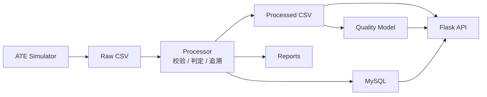

# 电源适配器 ATE 测试追溯与质量分析平台

面向电源适配器自动化测试场景的本地后台服务项目。项目覆盖 ATE 测试数据生成、规则判定、结果追溯、良率报表、接口查询和质量预测。

```text
C++ ATE Simulator -> Raw CSV -> Python Processor -> Reports / MySQL / Flask API / Quality Model
```

## 核心能力

- 支持模拟扫码、耐压测试、性能测试和自动分选流程，生成 ATE 原始测试数据。
- 支持按配置规则判断测试项和产品的 PASS / FAIL，并记录结构化不良原因。
- 支持生成日报、批次良率和不良项统计报表。
- 支持通过 Flask API 查询产品追溯、批次良率、工站统计和不良项。
- 支持可选 MySQL 存储，以及基于历史测试数据的质量预测接口。

## 业务链路



测试数据先由 C++ 模拟器生成，Python 后台按规则完成判定和追溯整理，再向报表、数据库、查询接口和预测模块输出结果。

## 目录结构

```text
cpp_ate_simulator/        C++ ATE 测试线数据模拟器
adapter_ate/              Python 后台服务与数据处理模块
config/                   测试判定规则
schemas/                  CSV 字段契约
sql/                      MySQL 表结构
scripts/                  本地运行脚本
tests/                    自动化测试
```

`adapter_ate` 主要模块：

```text
processor.py              原始数据校验、规则判定、结果生成
reports.py                良率、不良项、批次报表
storage.py                MySQL 建表、导入和查询
api.py                    Flask API 服务
ai_model.py               质量预测模型训练与推理
contracts.py              CSV 字段定义
```

## 快速运行

环境要求：

```text
Python 3.10+
C++17 编译器
Windows PowerShell 或 Linux/WSL shell
```

Windows PowerShell：

```powershell
.\scripts\bootstrap_demo.ps1
```

Linux / WSL：

```bash
bash scripts/bootstrap_demo.sh
```

运行完成后会生成：

```text
data/raw/                 原始测试数据
data/processed/           判定和追溯结果
reports/                  良率与不良项报表
models/                   质量预测模型
```

## API 服务

启动本地 API 服务：

```powershell
.\scripts\start_api.ps1
```

常用接口：

```text
GET  /api/health
POST /api/process
POST /api/reports/generate
POST /api/storage/import
GET  /api/products/<sn>
GET  /api/batches/<batch_no>/yield
GET  /api/defects
GET  /api/stations/<station_id>/summary
POST /api/predict
```

示例：

```powershell
Invoke-RestMethod http://127.0.0.1:5000/api/health
Invoke-RestMethod http://127.0.0.1:5000/api/batches/B20260425/yield
```

## 配置

测试判定规则位于：

```text
config/test_rules.json
```

API 查询数据源由 `ATE_DATA_SOURCE` 控制：

```text
csv      查询本地 processed CSV
mysql    查询 MySQL
auto     优先 MySQL，失败时回退 CSV
```

MySQL 为可选能力。需要使用数据库时，可复制 `.env.example` 为 `.env` 后填写本地连接配置。

## 测试

Windows PowerShell：

```powershell
.\.venv-win\Scripts\python.exe -m unittest discover -s tests -p "test*.py"
```

Linux / WSL：

```bash
.venv/bin/python -m unittest discover -s tests -p 'test*.py'
```

## 主要技术实现

- C++17：生成 ATE 测试线原始数据。
- Python：实现数据处理、报表、接口服务和模型训练。
- Flask：提供处理、报表、存储、查询和预测 API。
- pandas：生成良率、批次和不良项统计报表。
- MySQL / PyMySQL：保存和查询产品测试追溯数据。
- scikit-learn：基于测试项数据训练质量预测模型。
